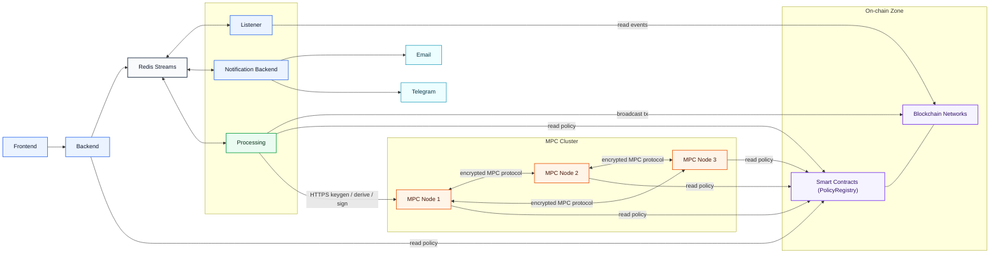

# FortVault Custody Platform
## Architecture and Control Overview (Regulatory Submission Draft)

Date: March 9, 2026  
Prepared for: Partner regulatory review

## 1. Executive Summary
FortVault is a multi-service digital asset custody platform with strict separation of duties:
- `fortvault-processing` is the only component allowed to request signatures and broadcast on-chain transactions.
- `fortvault-mpc` (3-node MPC cluster) holds signing key shares and performs threshold cryptography.
- Administrative systems (`backend`, `frontend`) can initiate actions but cannot sign or broadcast.

This design reduces compromise blast radius and centralizes transaction execution controls in a hardened processing layer.

## 2. System Components
- `fortvault-frontend` (React): admin/partner user interface.
- `fortvault-backend` (Node.js): back-office API, primary business-logic layer, and system of record for customer/partner/admin domain data (customer profiles, vault metadata, operational actions, and related back-office entities). It orchestrates workflows and publishes custody commands/events.
- `fortvault-processing` (Node.js): custody execution engine (address generation, transfer orchestration, transfer authorization verification, MPC integration, broadcast, state machine, idempotency).
- `fortvault-mpc` (Go): distributed threshold-signing service (key shares, keygen, derive, sign, independent transaction/policy verification before signing).
- `fortvault-listener` (Node.js): blockchain event listener (deposit/confirmation/tx status feeds).
- `fortvault-notification` (Node.js): outbound notifications (email/Telegram).
- `fortvault-contracts` (Hardhat/Solidity): on-chain policy registry, policy engine, and address-proof verifier.
- `fortvault-messaging` (shared library): typed Redis Streams publish/consume envelope and payload contracts.

## 3. High-Level Data Flow
1. Backend publishes process commands/events to Redis Streams.
2. Processing consumes, validates, persists local state in PostgreSQL, and executes custody logic.
3. Processing requests MPC operations (`/tss/keygen`, `/tss/derive`, `/tss/sign`) and polls session status.
4. Processing broadcasts signed transactions to chain RPC endpoints.
5. Listener publishes on-chain confirmations/failures.
6. Processing/backend/notification consume relevant events and update status/notify stakeholders.

## 3.1 Architecture Diagram

## 4. Trust and Threat Model (MVP)
Trusted:
- `fortvault-processing`
- `fortvault-mpc`
- authorized human approvers

Potentially compromised:
- backend
- frontend
- listener
- notification
- Redis transport

Security consequence:
- Compromise of non-trusted services does not grant signing or direct broadcast capability.
- Final custody execution remains gated by processing controls and MPC threshold signing.

## 5. Control Architecture
### 5.1 Separation of Duties
- Initiation (backend) is separated from execution (processing) and signing (MPC).
- No direct admin key access in backend/frontend services.

### 5.2 Key Management
- Keys are generated and held as MPC shares (no single private key on one node).
- Threshold model requires quorum to produce signatures.
- HD workflow for ECDSA supports root generation and child derivation.
- MPC-side transaction, authorization, and policy verification before signing.

### 5.3 Transaction Governance
- Processing enforces action state machine:
  - `CREATED/PENDING_APPROVALS -> APPROVED_READY -> SIGNING -> BROADCASTED -> CONFIRMED`
  - failure branches: `FAILED_RETRYABLE`, `FAILED_FINAL`
- Idempotency controls prevent duplicate execution on retries/replays.
- Transfer authorization is checked before execution using EIP-712 signatures, action metadata, source-wallet metadata, and on-chain policy checks.
- MPC re-checks transfer authorization and validates the raw transaction before threshold signing.

## 6. Persistence and Data Ownership
- Each service has its own PostgreSQL database as source of truth.
- Redis is transport only (not source of truth).
- Processing persists custody-critical entities:
  - inbound/outbound message logs
  - address requests, HD roots, wallet addresses
  - transfer requests
  - MPC request lifecycle (requested/polling/completed/failed)

This model supports deterministic restart recovery and audit reconstruction.

## 7. Supported Transaction Flows (Current MVP)
### 7.1 Address Generation
- Input: `evt.generate_address.process`
- Processing validates partner/chain/wallet type, allocates HD index, calls MPC keygen/derive.
- Output: `evt.generate_address.completed` (success or failed status payload).
- Generated address responses can include an MPC attestation proof over the derived public key and wallet context.

### 7.2 Transfers
- Input: `evt.transfer.process`
- Current implementation supports:
  - EVM native transfers
  - ERC20 transfers
  - Tron native transfers
  - TRC20 transfers
  - Bitcoin native transfers with constrained transaction shape
- Processing validates transfer signatures, policy context, source wallet metadata, and transaction parameters.
- MPC independently verifies the same transfer authorization payload and validates the raw transaction before signing.
- Processing requests MPC signature, validates signature applicability, broadcasts tx, tracks receipt, publishes completion status.

## 8. Compliance Positioning Notes
The architecture is designed to align with core custody-control expectations:
- key custody isolation and quorum-based signing
- strict execution control plane
- deterministic audit trail and replay-safe messaging
- separation between administrative control and cryptographic control

This document is a technical architecture draft. A full submission package should also include:
- formal information security policy mapping
- business continuity/disaster recovery procedures
- access control matrix and privileged access workflow
- penetration test and vulnerability management evidence
- production network and secret-management diagrams
