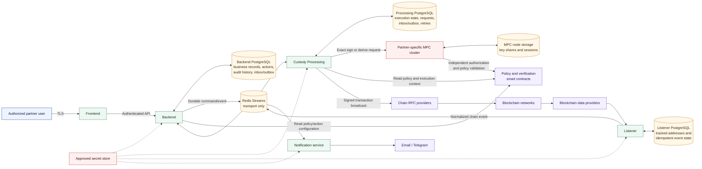

# FortVault Custody
## Technical and Security Overview for ISO 27001 Implementation

| Document field | Value |
| --- | --- |
| Document owner | FortVault |
| Intended audience | FortVault's ISO 27001 implementation partner |
| Classification | Confidential |
| Status | Current implementation overview |
| Version | 1.0 |
| Date | August 25, 2026 |

## 1. Purpose and Scope

This document provides a concise technical description of the FortVault Custody product for use during ISO/IEC 27001 implementation. It identifies the principal components, trust boundaries, information flows, data stores, external dependencies, and security controls that should be considered in the Information Security Management System (ISMS).

The current product scope includes:

- partner/workspace, user, role, customer, vault, asset, chain, and whitelisted-address management;
- action initiation, policy-based approvals, and status history;
- blockchain address generation and derivation;
- approved digital-asset transfer orchestration;
- threshold Multi-Party Computation (MPC) key generation and signing;
- blockchain transaction broadcasting and event ingestion; and
- operational notifications through configured channels.

This is a supporting architecture document. It does not by itself establish ISO 27001 compliance, production readiness, or the effectiveness of operational controls.

## 2. Architecture Overview

### Principal trust boundaries

1. **User-device boundary:** browser input is untrusted until authenticated, authorized, validated, and associated with the active partner.
2. **Business-control boundary:** Backend owns business records, tenant scope, actions, approvals, and user permissions.
3. **Asynchronous transport boundary:** Redis Streams transports commands and events but is not a durable source of business truth.
4. **Execution boundary:** Custody Processing owns execution state, transaction construction, retries, MPC coordination, and blockchain broadcast.
5. **Cryptographic boundary:** a dedicated MPC cluster is deployed per partner. MPC nodes hold distributed key shares and independently validate the exact signing request and authorization evidence.
6. **External boundary:** smart contracts, RPC providers, blockchain networks, notification providers, and cloud services are supplier dependencies.

Backend, Frontend, Redis, Listener, Notification, and Custody Processing are not sufficient by themselves to authorize an MPC signature. The MPC boundary must independently validate the action, payload, chain, asset, source, destination, amount, nonce, approvals, signer authorization, expiry, policy decision, and replay protections applicable to the request.

## 3. Component Responsibilities

| Component | Primary responsibility | Information owned |
| --- | --- | --- |
| Frontend | User interface for custody administration and approvals | No authoritative business or authorization state |
| Backend | Authentication, tenant scope, users and roles, customers, vaults, actions, approvals, policy orchestration, API, and business history | Business and audit records in Backend PostgreSQL |
| Messaging | Typed Redis Streams contracts and transport behavior | No durable business state |
| Custody Processing | Address and transfer execution, exact transaction construction, MPC coordination, broadcast, retries, and reconciliation | Execution state in Processing PostgreSQL |
| MPC | Threshold key generation, derivation, signing, attestation, and independent authorization validation | Key shares and MPC session state within MPC node storage |
| Contracts | Policy registry, policy engine, and address-verification logic | On-chain policy and verification state |
| Listener | Tracks configured addresses and publishes normalized blockchain movements | Ingestion and deduplication state in Listener PostgreSQL |
| Notification | Formats and sends operational notifications | Delivery configuration and transient message context |

Each stateful service owns its own database. Services must not read another service's database directly. Integration is performed through authenticated APIs or versioned asynchronous messages.

## 4. Main Custody Flows

### 4.1 Action and approval

1. An authenticated user initiates an action through the Frontend.
2. Backend applies partner scope, role permissions, validation, duplicate-action checks, and the configured approval policy.
3. Backend persists the action and approval state before publishing an execution command.
4. Required approvers approve or reject the exact action according to policy.
5. Only an action that reaches its required approval state can proceed to execution.

### 4.2 Address generation

1. Backend creates an approved address-generation request and publishes it through its durable outbox.
2. Custody Processing idempotently records the request and reserves derivation state before contacting MPC.
3. MPC generates or derives the public key and can return address-attestation evidence.
4. Processing persists the result and publishes a completion event through its outbox.
5. Backend idempotently records the resulting address against the correct partner, vault/customer, asset, and chain.

### 4.3 Asset transfer

1. Backend reconstructs and verifies the exact approved transfer from trusted business records.
2. Custody Processing records the request, constructs the chain-specific transaction, and persists signing context before MPC submission.
3. MPC independently validates the exact transaction and authorization evidence before threshold signing.
4. Custody Processing validates the returned signature and broadcasts the signed transaction through the configured chain provider.
5. Broadcast and receipt reconciliation are persisted so retries do not create a second logical transfer.
6. Listener and/or provider responses supply normalized chain events used to update history and notify authorized users.

## 5. Security and ISO 27001 Control Considerations

| Control area | Technical implementation | Typical ISMS evidence |
| --- | --- | --- |
| Identity and access control | Authenticated API access, partner-scoped data access, roles and permissions, and approval policies | Access-control policy, role matrix, user access review, privileged-access records |
| Segregation of duties | Initiation, approval, execution, and threshold signing are separated across users and components | Approval-policy configuration, organization role assignments, test evidence |
| Tenant isolation | Partner scope is enforced server-side; frontend filtering is not treated as authorization | Tenant-isolation tests, code review, access test results |
| Cryptographic key protection | Partner-specific threshold MPC; no complete custody private key is held by Backend, Frontend, or Processing | MPC deployment design, node ownership record, key ceremony evidence, recovery procedure |
| Transaction authorization | Backend and MPC validate authorization at separate boundaries; MPC binds approval evidence to the exact signing payload | Policy configuration, signed-action samples, negative/replay test results |
| Message integrity and resilience | Durable inbox/outbox records, idempotency keys, payload matching, retry state, and acknowledgment after persistence | Database schema, retry tests, broker configuration, failure-recovery tests |
| Secret management | Runtime secrets are supplied from approved secret-management or deployment mechanisms and must not be placed in messages or logs | Secret inventory, IAM policy, rotation record, configuration review |
| Logging and auditability | Actions, approvals, execution states, message state, and transaction results are persisted by their owning services | Central log samples, audit-history export, retention policy, time-synchronization evidence |
| Secure development and change | Source-controlled code, migrations, automated tests, and controlled deployment artifacts | Pull-request approvals, CI results, release records, migration approvals |
| Availability and recovery | Independent service state, resumable execution, provider reconciliation, and service-specific backups | Backup schedule, restore tests, RTO/RPO, failover runbooks, supplier SLAs |

## 6. Information and Data Stores

| Information category | Primary location | Protection expectation |
| --- | --- | --- |
| User, role, partner, customer, and vault metadata | Backend PostgreSQL | Encryption at rest, least-privilege DB access, backup and retention controls |
| Actions, approvals, and business history | Backend PostgreSQL | Integrity protection, access logging, retention aligned with legal requirements |
| Execution, retry, and broadcast state | Processing PostgreSQL | Exact-value storage, idempotency, restricted service access, tested recovery |
| Tracked addresses and ingestion state | Listener PostgreSQL | Restricted access and duplicate-event protection |
| MPC key shares and sessions | MPC node storage | Strong node isolation, encrypted storage, restricted administrative access, secure backup/recovery |
| API keys, RPC credentials, and notification credentials | Approved secret store | No source-control storage; scoped IAM, rotation, monitoring, and revocation |
| Commands and events | Redis Streams | Private network access, authentication, bounded retention; never the only durable record |

Financial values must be represented as exact integers in blockchain base units. Floating-point arithmetic must not be used for authorization, balances, amounts, or fees.

## 7. External Dependencies

- supported blockchain networks and their finality characteristics;
- blockchain RPC and webhook/data providers;
- cloud hosting, database, cache, secret-management, and monitoring services;
- email and Telegram delivery providers; and
- smart contracts deployed for the relevant partner environment.

Supplier selection, contractual security requirements, availability commitments, data locations, incident notification, and exit arrangements should be maintained in the ISMS supplier register.

## 8. Operational Requirements and Limitations

- Production deployment must enforce TLS, network segmentation, least-privilege service identities, centralized logging, time synchronization, monitoring, backups, and tested restoration.
- MPC node ownership, threshold, policy configuration, backup, recovery, replacement, and incident procedures require separate approved operational documents and evidence.
- Confirmation/finality behavior is chain- and provider-specific and must be documented in operating procedures.
- Offline MPC, Cold Signer, and Bootstrap Station workflows are development prototypes and are outside the current production Custody scope unless separately approved, threat-modeled, tested on physical devices, and independently reviewed.
- Retention periods, RTO/RPO, incident severity, and control ownership are ISMS decisions and are not defined by this architecture document.

## 9. Recommended Companion Evidence

For the ISO 27001 implementation, this document should be accompanied by:

1. asset and information inventory;
2. data-flow and network/deployment diagrams for each environment;
3. user-role and approval-policy matrix;
4. MPC key-management, backup, recovery, and node-replacement procedures;
5. secret-management and rotation procedure;
6. backup/restore and business-continuity test results;
7. vulnerability, penetration-test, and dependency-management evidence;
8. logging, monitoring, alerting, and incident-response procedures;
9. supplier register and provider risk assessments; and
10. change-management and production release evidence.

