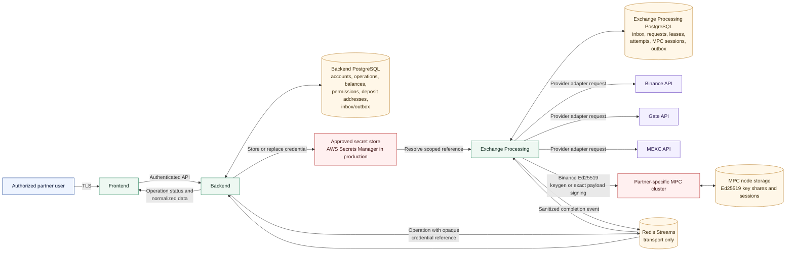

# FortVault Exchange
## Technical and Security Overview for ISO 27001 Implementation

| Document field | Value |
| --- | --- |
| Document owner | FortVault |
| Intended audience | FortVault's ISO 27001 implementation partner |
| Classification | Confidential |
| Status | Current implementation overview |
| Version | 1.0 |
| Date | August 25, 2026 |

## 1. Purpose and Scope

This document provides a concise technical description of the FortVault Exchange product for use during ISO/IEC 27001 implementation. It identifies the principal components, information flows, data stores, external providers, trust boundaries, and security controls relevant to exchange-account integration.

The current implementation is a read-only exchange integration supporting:

- exchange-account configuration for Binance, Gate, and MEXC;
- HMAC authentication for Binance, Gate, and MEXC;
- MPC-backed Ed25519 authentication for Binance;
- connection testing;
- account permission synchronization;
- spot-balance synchronization; and
- deposit-network and deposit-address synchronization.

Exchange withdrawal execution, trading, and order management are outside the current implemented product scope. They must not be enabled until their action/approval permissions, exact payload authorization, provider execution controls, testing, and operational procedures are completed and approved.

This is a supporting architecture document. It does not by itself establish ISO 27001 compliance, production readiness, or the effectiveness of operational controls.

## 2. Architecture Overview

### Principal trust boundaries

1. **User-device boundary:** browser input is untrusted until authenticated, validated, and associated with the active partner. Granular role authorization for exchange endpoints must be verified as a separate control.
2. **Business-control boundary:** Backend owns partner-scoped exchange-account metadata, operations, normalized balances, synchronized permissions, and deposit addresses.
3. **Secret boundary:** raw exchange credentials are held in the approved secret store. Messages carry an opaque credential reference, not the secret value.
4. **Asynchronous transport boundary:** Redis Streams transports commands and completion events but is not durable business storage.
5. **Execution boundary:** Exchange Processing owns provider execution, retry state, rate limiting, leases, and provider response normalization in a separate database. It does not read Backend PostgreSQL.
6. **Cryptographic boundary:** Binance Ed25519 private-key material remains inside the partner-specific MPC cluster. Exchange Processing receives only the public key and signatures required for provider authentication.
7. **Provider boundary:** Binance, Gate, and MEXC are external suppliers with independent availability, security, permission, rate-limit, and incident characteristics.

## 3. Component Responsibilities

| Component | Primary responsibility | Information owned |
| --- | --- | --- |
| Frontend | Exchange-account user interface, synchronization controls, balances, permissions, and operation status | No authoritative business or authorization state |
| Backend | Authentication, tenant scope, account metadata, operation lifecycle, normalized balances, permissions, deposit addresses, and API | Exchange business records in Backend PostgreSQL |
| Messaging | Typed Redis Streams command/result contracts | No durable business state |
| Exchange Processing | Credential resolution, provider adapters, rate limiting, retries, leases, Ed25519 MPC coordination, result sanitization, and completion delivery | Execution state in Exchange Processing PostgreSQL |
| Secret store | HMAC API keys/secrets or Ed25519 exchange API key references | Exchange credentials protected by scoped IAM |
| MPC | Binance Ed25519 threshold key generation and signing | Ed25519 key shares and MPC session state within MPC node storage |
| Exchange providers | External account, permission, balance, network, and deposit-address APIs | Provider-controlled exchange account data |

Backend and Exchange Processing own separate PostgreSQL databases. Exchange Processing must not connect to or query the Backend database.

## 4. Main Exchange Flows

### 4.1 HMAC account setup and synchronization

1. An authenticated user submits exchange-account configuration through the Frontend.
2. Backend applies partner scope and validation, then stores the raw API credential in the approved secret store.
3. Backend retains only the provider type and opaque credential reference in its database and operation message.
4. Backend persists the operation and outbound message before Redis publication.
5. Exchange Processing idempotently records the command, resolves the credential reference within its permitted secret namespace, and calls the provider adapter.
6. Exchange Processing persists provider attempts and the normalized result, then publishes a sanitized completion event through its outbox.
7. Backend idempotently updates the account, operation, balances, permissions, or deposit addresses.

### 4.2 Binance Ed25519 setup and request signing

1. Backend creates an Ed25519 key-generation operation without sending a private credential.
2. Exchange Processing persists the request and asks the partner-specific MPC cluster to generate the Ed25519 key.
3. Backend stores the returned public key and MPC key identifier. The private key remains distributed inside MPC.
4. After the public key is registered with Binance, the Binance API key is stored in the secret store.
5. For each supported Binance request, Exchange Processing constructs the exact authentication payload and requests its signature from MPC.
6. Exchange Processing sends the signed request to Binance and returns only sanitized results to Backend.

### 4.3 Balance, permission, and deposit-address synchronization

1. Backend creates a uniquely identified synchronization operation.
2. Exchange Processing claims the persisted request with a fenced lease and applies provider/account rate limits.
3. The provider adapter retrieves the requested read-only information.
4. Provider data is normalized and persisted with the operation result.
5. Backend treats the completion event idempotently and stores the latest authoritative business view for the partner account.

## 5. Security and ISO 27001 Control Considerations

| Control area | Technical implementation | Typical ISMS evidence |
| --- | --- | --- |
| Identity and access control | Authenticated API access and server-side partner scope are implemented; granular exchange endpoint permissions require control verification | Access-control policy, role matrix, endpoint-permission test results, access reviews |
| Least-privilege provider access | Current scope requires read-only account, balance, permission, and deposit-address capabilities | Provider API-key configuration screenshots, permission reviews, IP allowlist evidence |
| Tenant isolation | Exchange accounts and operations are partner-scoped in Backend | Tenant-isolation tests, code review, access test results |
| Secret management | Raw HMAC secrets are stored in the approved secret store; Redis messages contain opaque references; local-file storage is development-only | Secret inventory, AWS IAM policy, rotation and revocation records, configuration review |
| Cryptographic key protection | Binance Ed25519 private-key material remains in partner-specific threshold MPC | MPC deployment record, node ownership, key-generation evidence, recovery procedure |
| Message resilience | Backend and Exchange Processing use durable inbox/outbox records, idempotency, payload checks, retries, and fenced worker leases | Database schema, duplicate-delivery tests, retry and restart test results |
| Provider failure handling | Provider attempts and operation status are persisted; retryable and final failures are separated | Failure test results, alert samples, incident runbook, provider SLA |
| Logging and auditability | Account changes, operations, attempts, statuses, and synchronized results are persisted by owning services | Central log samples, operation history, retention policy, time-synchronization evidence |
| Secure development and change | Source-controlled adapters, migrations, tests, and deployment configuration | Pull-request approvals, CI results, release records, migration approvals |
| Supplier management | Binance, Gate, MEXC, cloud, and secret-management services are external dependencies | Supplier register, due-diligence records, contracts, incident and exit clauses |

## 6. Information and Data Stores

| Information category | Primary location | Protection expectation |
| --- | --- | --- |
| Exchange-account metadata and provider type | Backend PostgreSQL | Encryption at rest, partner scope, least-privilege DB access |
| Normalized balances, permissions, and deposit addresses | Backend PostgreSQL | Integrity controls, synchronization timestamps, audit retention |
| Operation and message state | Backend PostgreSQL | Idempotency, status history, backup and recovery |
| Provider requests, attempts, leases, and completion outbox | Exchange Processing PostgreSQL | Restricted service access, retry safety, tested restart recovery |
| HMAC API key and secret | Approved secret store | Scoped IAM, encryption, rotation, monitoring, and revocation |
| Binance Ed25519 API key | Approved secret store | Scoped IAM and rotation; the corresponding private key remains in MPC |
| Binance Ed25519 private-key shares | MPC node storage | Strong node isolation, encrypted storage, restricted access, secure backup/recovery |
| Commands and completion events | Redis Streams | Private network access, authentication, bounded retention; no raw credentials |

Balances and financial values must be represented using exact decimal or integer forms. Floating-point values must not be used for authorization, transfer amounts, fees, or accounting decisions.

## 7. External Dependencies

- Binance API and account security controls;
- Gate API and account security controls;
- MEXC API and account security controls;
- cloud hosting, PostgreSQL, Redis, secret-management, and monitoring services; and
- the partner-specific MPC cluster for Binance Ed25519 authentication.

The ISMS supplier register should document service criticality, data exchanged, contractual security requirements, availability commitments, incident notification, data location, sub-processors, and exit/revocation procedures.

## 8. Operational Requirements and Limitations

- Production exchange API keys should be restricted to the minimum read-only permissions required by the current scope. Withdrawal and trading permissions should remain disabled.
- Current exchange-account APIs use authenticated access and partner scope. Granular role/permission mapping must be verified and enforced before production use.
- Provider IP allowlists should be enabled where supported and aligned with controlled outbound network addresses.
- Production must use AWS Secrets Manager or another approved secret store. Local credential files are for local development only.
- Credential replacement, rotation, revocation, and provider-account offboarding require approved operating procedures and evidence.
- Provider responses can be delayed, rate-limited, incomplete, or temporarily inconsistent. Monitoring and reconciliation procedures must account for these conditions.
- Granular action/approval policy for future exchange withdrawals and orders is not part of the current read-only scope and must be completed before enabling those operations.
- Retention periods, RTO/RPO, incident severity, and control ownership are ISMS decisions and are not defined by this architecture document.

## 9. Recommended Companion Evidence

For the ISO 27001 implementation, this document should be accompanied by:

1. exchange-provider inventory and supplier risk assessments;
2. exchange API-key permission and IP-allowlist evidence;
3. secret inventory, IAM policy, rotation, and revocation procedures;
4. exchange-account onboarding and offboarding procedures;
5. data-flow and environment deployment diagrams;
6. Backend and Exchange Processing access matrices;
7. retry, duplicate-delivery, provider-failure, and restart-recovery test results;
8. monitoring, alerting, and incident-response procedures;
9. backup/restore evidence and RTO/RPO definitions; and
10. change-management and production release evidence.
